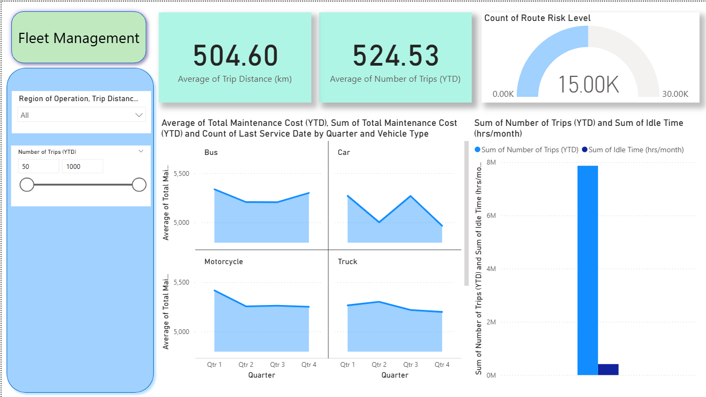

# Fleet Management Dashboard

This project presents an interactive Power BI dashboard for monitoring fleet operations and vehicle performance.

## Tools Used
- Power BI
- Data Analysis
- Data Visualization

## Dashboard Insights

The dashboard provides insights into fleet operations including:

- Average trip distance
- Number of trips (Year-to-date)
- Vehicle maintenance cost trends
- Idle time analysis
- Route risk level monitoring

## Key Features

- Interactive filters by region and trip distance
- Vehicle type analysis (Bus, Car, Motorcycle, Truck)
- Maintenance cost trends across quarters
- Trip performance and idle time tracking

## Dashboard Preview

## Author
Anjum Khan

